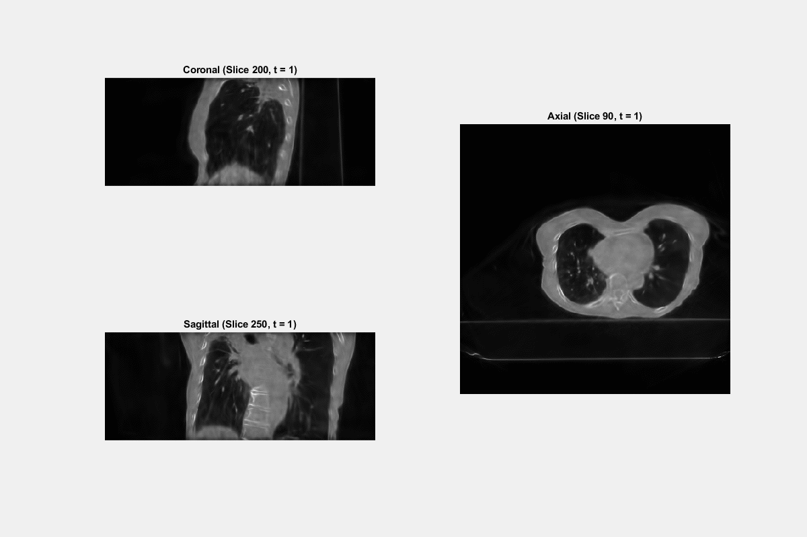
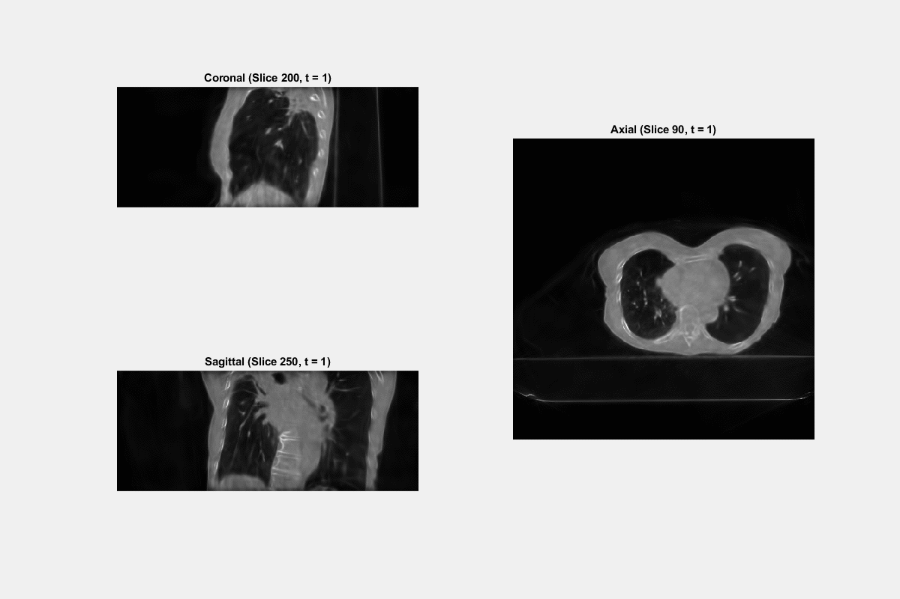
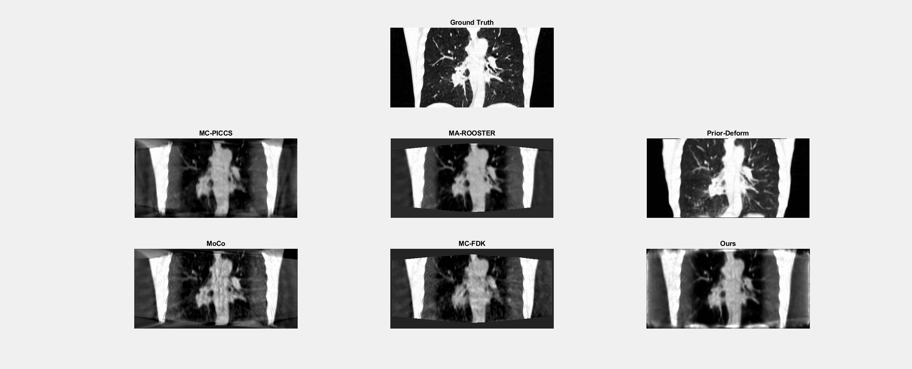
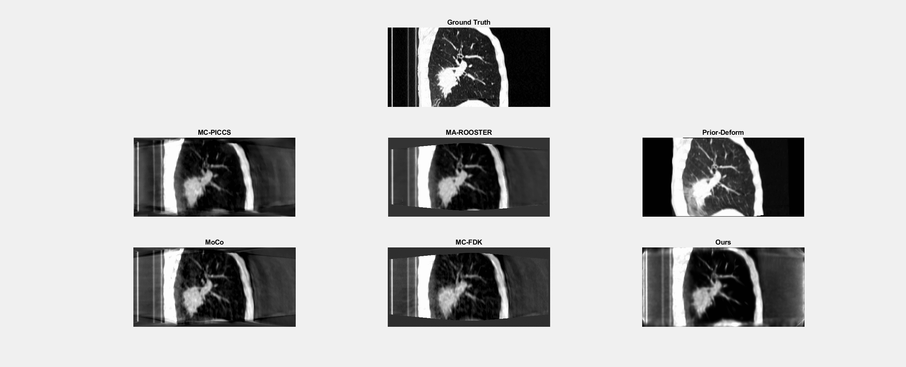

# Dynamic Cone Beam CT Reconstruction via Spatiotemporal Gaussian Neural Representation

Paper Arxiv: https://arxiv.org/abs/2501.04140

**Abstract:**

In image-guided radiotherapy (IGRT), four-dimensional cone-beam computed tomography (4D-CBCT) is critical for assessing tumor motion during a patient’s breathing cycle prior to beam delivery. However, generating 4D-CBCT images with sufficient quality requires significantly more projection images than a standard 3D-CBCT scan, leading to extended scanning times and increased imaging dose to the patient. To address these limitations, there is a strong demand for methods capable of reconstructing high-quality 4D-CBCT images from a 1-minute 3D-CBCT acquisition. The challenge lies in the sparse sampling of projections, which introduces severe streaking artifacts and compromises image quality. This paper introduces a novel framework leveraging spatiotemporal Gaussian representation for 4D-CBCT reconstruction from sparse projections, achieving a balance between streak artifact reduction, dynamic motion preservation, and fine detail restoration. Each Gaussian is characterized by its 3D position, covariance, rotation, and density. Two-dimensional X-ray projection images can be rendered from the Gaussian point cloud representation via X-ray rasterization. The properties of each Gaussian were optimized by minimizing the discrepancy between the measured projections and the rendered X-ray projections. A Gaussian deformation network is jointly trained to deform these Gaussian properties to obtain a 4D Gaussian representation for dynamic CBCT scene modeling. The final 4D-CBCT images are reconstructed by voxelizing the 4D Gaussians, achieving a high-quality representation that preserves both motion dynamics and spatial detail. 

**Key Results:**

**1. Clinical Data**
The proposed method can recon high temporal (50 phases) CBCT from a 1-min scan from Varian Truebeam.  Top one is 10 phases, bottom one is 50 phases.

**2. SPARE Data** 
Only showing one case. Please see assets folder for detailed list of Gifs for 29 reconstructions.

**To run the code**
Follow R2_Gaussians (https://github.com/ruyi-zha/r2_gaussian) to install dependencies. 

**For your own data**
1. run init_pcd.py to generate the initial points from CGLS reconstruction (example: https://drive.google.com/file/d/10NPiS79sBjeubEN_UqlX-VD-4nmq81yB/view?usp=sharing).
2. As an example, put the downloaded data in ./data/spare_dataset/MC_V_P2_NS_01. Then, run (python.exe train.py -s data/spare_dataset/MC_V_P2_NS_01).

For datasets used, please refer to: https://image-x.sydney.edu.au/spare-challenge/ for details.

Comparison methods:

**MC-FDK**: the motion-compensated FDK [1] implemented by Dr Simon Rit from the CREATIS laboratory. A prior DVF is built from the pre-treatment 4D-C. Using this DVF, a FDK reconstruction is performed but with the backprojected traces deformed to correct for respiratory motion.

**MA-ROOSTER**: the motion-aware spatial and temporal regularization reconstruction [2] implemented by Dr Cyril Mory from the CREATIS laboratory. The reconstruction is solved iteratively by enforcing spatial smoothness as well as temporal smoothness along a warped trajectory according to the prior DVF built from the pre-treatment 4D-CT.

**MoCo**: the data-driven motion-compensated method [3] implemented by Dr Matthew Riblett from the Virginia Commonwealth University and Prof Geoffrey Hugo from the Washington University. The motion-compensation DVF is built using groupwise deformable image registration of a preliminary 4D-CBCT reconstruction computed by the PICCS method.

**MC-PICCS**: the motion-compensated (MC) prior image constrained compressed sensing (PICCS) reconstruction [4] implemented by Dr Chun-Chien Shieh from the University of Sydney. The reconstruction is solved using a modified PICCS algorithm, where the prior image is selected to be the MC-FDK reconstruction.

**Prior deforming**: the reconstruction is solved by deforming the pre-treatment 4D-CT to match with the CBCT projections [5]. This method was implemented by Dr Yawei Zhang and A/Prof Lei Ren at the Duke University.

[1] S. Rit, J. W. H. Wolthaus, M. van Herk, and J.-J. Sonke, On-the-fly motion-compensated cone-beam CT using an a priori model of the respiratory motion, Med Phys 36, 2283 (2009), ISSN 2473-4209, URL http://dx.doi.org/10.1118/1.3115691.

[2] C. Mory, G. Janssens, and S. Rit, Motion-aware temporal regularization for improved 4D cone-beam computed tomography, Phys Med Biol 61, 6856 (2016), ISSN 0031-9155.

[3] M. J. Riblett, G. E. Christensen, E. Weiss, and G. D. Hugo, Data-driven respiratory motion compensation for four-dimensional cone-beam computed tomography (4D-CBCT) using groupwise deformable registration, Med Phys 45, 4471(2018), 
https://aapm.onlinelibrary.wiley.com/doi/pdf/10.1002/mp.13133.

[4] C.-C. Shieh, V. Caillet, J. Booth, N. Hardcastle, C. Haddad, T. Eade, and P. Keall, 4D-CBCT reconstruction from a one minute scan, in Engineering and Physical Sciences in Medicine Conference (Hobart, Australia., 2017).

[5] L. Ren, J. Zhang, D. Thongphiew, D. J. Godfrey, Q. J. Wu, S.-M. Zhou, and F.-F. Yin, A novel digital tomosynthesis (DTS) reconstruction method using a deformation field map, Med Phys 35, 3110 (2008), ISSN 0094-2405, URL http://www.ncbi.nlm.nih.gov/pmc/articles/
PMC2809715/.

# Acknowledgement

This work is inspired by: 

https://guanjunwu.github.io/4dgs/

https://github.com/ruyi-zha/r2_gaussian

